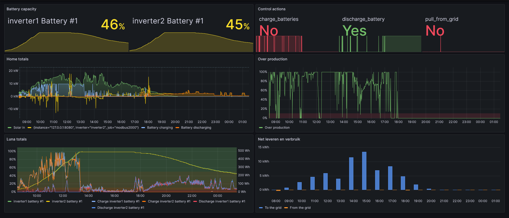
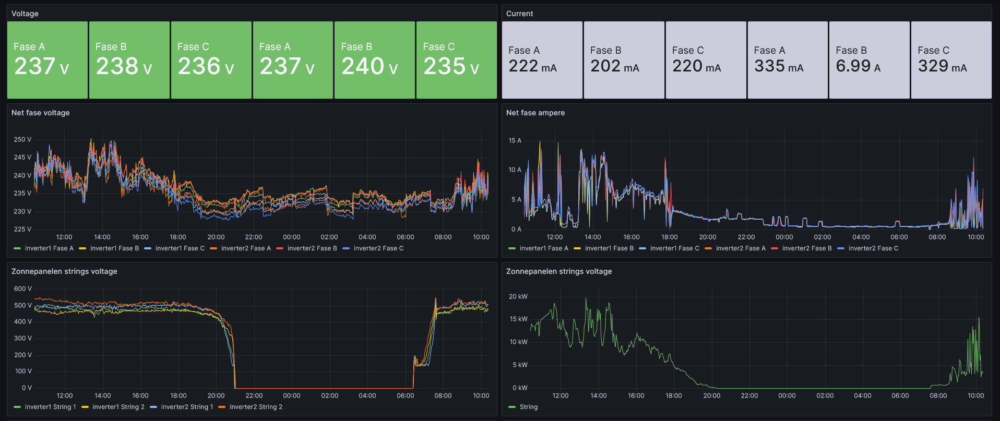
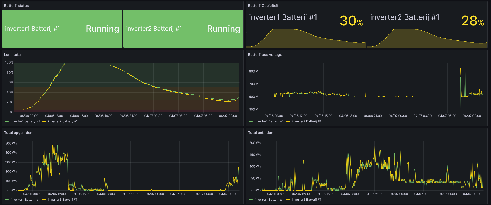
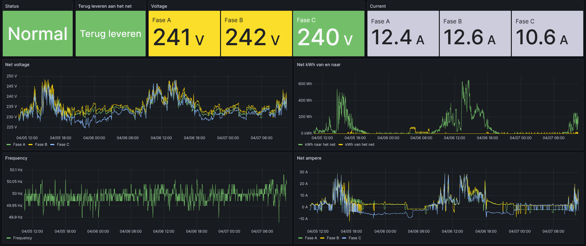

# Vonkje
Vonkje is a small service which manages communication, metrics, decision making and control of a solar plant. The goal of this application is to provide insight and to improve the efficiency of a solar plant.

## Runtime Dependencies
- Grafana for visualisation
- Victoria Metrics for metrics storage

## Development Dependencies
- **Golang** 1.22 or higher
- **Docker** for Victoria Metrics and Grafana

## Images
Overview:

Solar:

Battery:

Power Meter:

